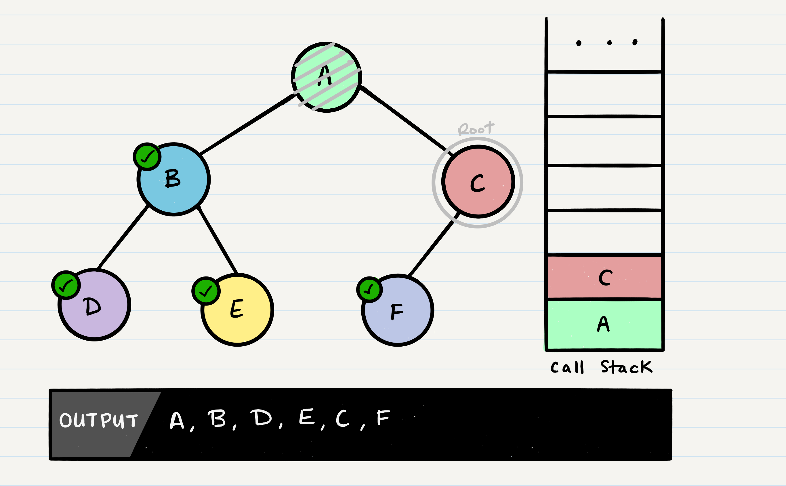
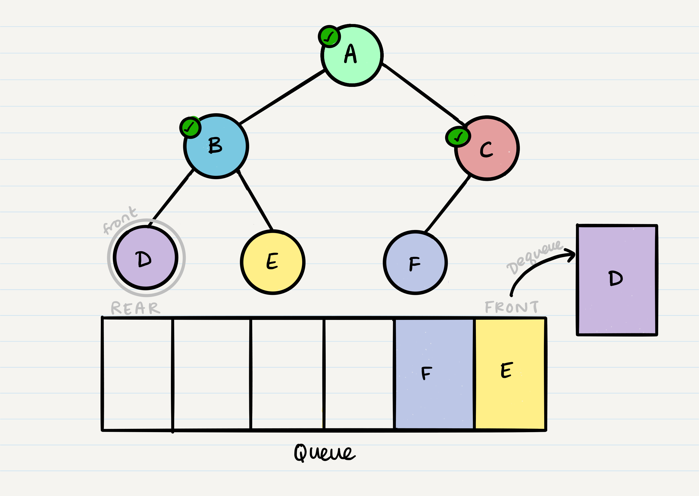
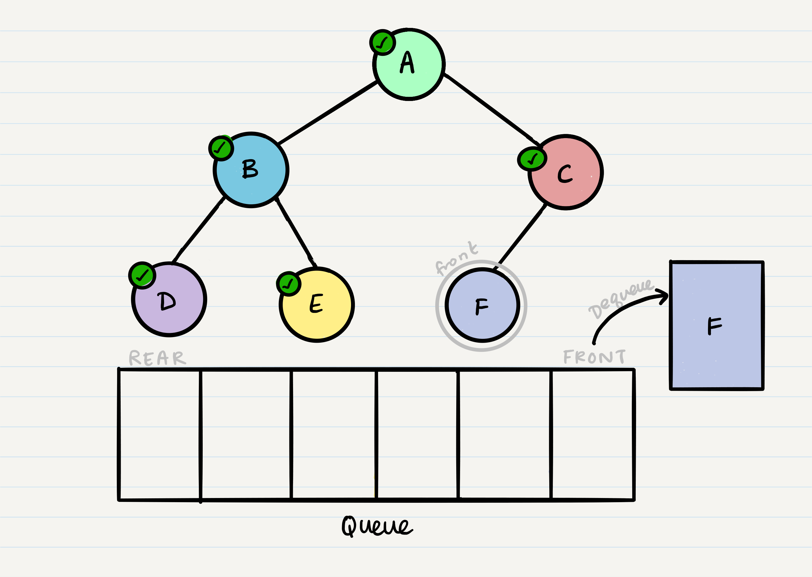

# Trees

In this tutorial, we'll be covering **Binary Trees** and **Binary Search Trees**. We will review some common terminology that is shared amongst all of the trees and then dive into specifics of the different types.

## Common Terminology

1. _Node_ - a node is the individual item/data that make up the data structure.
1. _Root_ - The root is the first/top `Node` in a tree
1. _Left Child_ - The node that is positioned to the left of the root
1. _Right Child_ - The node that is positioned to the right of the root
1. _Edge_ - The edge in a tree is the link between two nodes
1. _Leaf_ - A leaf is the node that does not contain either a left child or a right child node.
1. _Height_ - The height of a tree is determined by the number of edges from the root to the bottommost node.
   This is what a tree looks like:

{:target="\_blank"}

### Traversals

There are two categories of traversals when it comes to trees.

1. Depth First
2. Breadth First

#### Depth First

Depth first is a traversal that traverses the depth (height) of the tree.

The different traversals determine at which point the `Root` is looked at.
Here are the three different depth first traversals broken down:

1. Preorder
   - Root, Left, Right
2. Inorder
   - Left, Root, Right
3. Postorder
   - Left, Right, Root

{:target="\_blank"}

Output:

- **_Preorder:_** A, B, D, E, C, F
- **_Inorder:_** D, B, E, A, F, C
- **_Postorder:_** D, E, B, F, C, A

The most common way to traverse through a tree is to use recursion.
With these traversals, we rely on the call stack to navigate back up
the tree when we have reached the end.

Let's breakdown the `PreOrder` traversal.

Here is the pseudo code for a PreOrder traversal:

```javascript
ALGORITHM PreOrder(root)
{
  OUTPUT <-- root.Value

    if root.LeftChild is not NULL
        PreOrder(root.LeftChild)

    if root.RightChild is not NULL
        PreOrder(root.RightChild)
}
```

1. PreOrder means that the `root` has to be looked at first.
   The first thing we do is look at the root....in our case, we will just output that
   to the console. When we call `PreOrder` for the first time, the `root`, also refereed to as NodeA,
   will be added to the call stack.

{:target="\_blank"}

2. Next we start reading the code from top to bottom. The first line of code reads this:

```javascript
OUTPUT < --node.Value;
```

This means that we will output the `root.Value` out to the console.

3. Next, the code above is instructing us to check if our `root` has a `LeftChild`.
   If the root does, we will then send the `LeftChild` to our PreOrder method recursively.
   `NodeB` is now our new root node, and after this call, `NodeB` is pushed onto the call stack.

{:target="\_blank"}

4. This process continues until we reach a `Leaf`. When we do hit a leaf, this is the state of our tree:

{:target="\_blank"}

It's important to note a few things that are about to happen.

- The value of the root will output to the console.
- The program will look for both a `root.LeftChild` and a `root.RightChild`.
  Both will come be false, so it will end the execution of that method call.
- `NodeD` will "pop" off of the call stack and the root will be reassigned back to `NodeB`.

{:target="\_blank"}

5. The Code block will now pick up where it left off when we were in the `NodeB` frame.
   Since it already looked for `root.LeftChild`, it will now look for `root.RightChild`.

{:target="\_blank"}

6. `NodeE` will output to the console. Since `NodeE` is a leaf, it will complete the method code
   block, and pop `NodeE` off of the call stack and make it's way back up to `NodeB`.

{:target="\_blank"}

7. In the call frame, `NodeB` has already checked for `root.LeftChild`, and `root.RightChild`,
   the code block will complete and pop off `NodeB` from the call stack, and leave `NodeA` as the root.

{:target="\_blank"}

8. Following the same pattern as we did with the other nodes, `NodeA`'s call stack frame will pick
   up where it left off, and check out `root.RightChild`.
   `NodeC` will be added to the call stack frame, and it will now be reassigned as the new root.

{:target="\_blank"}

9. `NodeC` will be outputted to the console, and `root.LeftChild` will be evaluated, and
   `PreOrder()` will be called sending `root.LeftChild` as it's root.

{:target="\_blank"}

10. At this point, the program will find that `NodeF` does not have any children and it will
    make it's way back up the call stack up to `NodeC`.

{:target="\_blank"}

11. NodeC does not have a `root.RightChild`, so it will pop off the call stack and return to Node A.

{:target="\_blank"}

12. Congratulations! Your PreOrder traversal is completed!

Here is the pseudo code for all 3 of the depth first traversals.

```javascript
ALGORITHM PreOrder(node)
// INPUT <-- root Node
// OUTPUT <-- preorder output of tree nodes

    OUTPUT <-- node.Value

    if node.LeftChild is not Null
        PreOrder(node.LeftChild)

    if node.RightChild is not NULL
        PreOrder(node.RightChild)

```

```javascript
ALGORITHM InOrder(node)
// INPUT <-- root node
// OUTPUT <-- inorder output of tree nodes

    if node.LeftChild is not NULL
        InOrder(node.LeftChild)

    OUTPUT <-- node.Value

    if node.RightChild is not null
        InOrder(node.RightChild)

```

```javascript
ALGORITHM PostOrder(node)
// INPUT <-- root node
// OUTPUT <-- postorder output of tree nodes

    if node.LeftChild is not NULL
        InOrder(node.LeftChild)

    if node.RightChild is not null
        InOrder(node.RightChild)

    OUTPUT <-- node.Value
```

Notice the similarities between the three different traversals above.
The biggest difference between each of the traversals is **_when you are looking
at the root node_**.

#### Breadth First

The breadth first traversal iterates through the tree by
going through each level of the tree node by node.

**_Output:_** A, B, C, D, E, F

Traditionally the breadth first traversal leverages a queue to
traverse the width (or the breadth) of the tree. Let's break down
the process:

1. First, Let's take a look at a tree that we can conduct a Breadth First traversal on:

{:target="\_blank"}

2. Let's start by putting the root Node into the queue (`Queue.Enqueue(root`)

{:target="\_blank"}

3. Now that we have one node in our queue, let's `Dequeue`.

{:target="\_blank"}

4. Since we have completed the `Dequeue` action on the root node, we can now `Enqueue` both
   it's `root.LeftChild` and it's `root.rightChild`.

{:target="\_blank"}

4. We will repeat this process with the next node in the front of the queue.

{:target="\_blank"}

5. With `NodeB`, we can then `Enqueue` the two children node.

{:target="\_blank"}

6. `Dequeue` the front of the queue
   {:target="\_blank"}

7. `Enqueue` the children...
   {:target="\_blank"}

8. Keep `Dequeue`ing, and only `Enqueue` if the `node.LeftChild` or `node.RightChild` is not null.
   {:target="\_blank"}
   {:target="\_blank"}
   {:target="\_blank"}

Here is the pseudo code, utilizing a built in queue, to
implement a Breadth First traversal.

```javascript
ALGORITHM BreadthFirst(root)
//INPUT <-- root node
// OUTPUT <-- front node of queue to console

    Queue breadth <-- new Queue()
  breadth.Enqueue(root)

  while breadth.Peek
      Node front = breadth.Dequeue()
    OUTPUT <-- front.Value

    if front.LeftChild is not null
      breadth.Enqueue(front.LeftChild)

    if front.RightChild is not NULL
      breadth.Enqueue(front.RightChild)
```

## Binary Trees

Binary Trees are trees that only contain no more than 2 children. There is not a specific
sorting order for a binary tree. Nodes can be added into a binary tree wherever space allows.

Here is what a binary tree looks like:

{:target="\_blank"}

### Adding a node

Because there is no structure to where nodes are "supposed to go" in a binary tree, it really doesn't matter where a new node gets placed.

One strategy for adding a new node to a binary tree is to fill all "child" spots from the top down. To do so, we would leverage the use of breadth first traversal.

During the traversal, we will find the first node that does not have 2 child nodes, and insert
the new node as a child. Prefer filling from left to right.

In the event you would like to have a node placed in a specific location, you need to reference not only the new
node that is created, but also the parent node, to which the new node is attached.

### Big O

The Big O time of an insertion an searching in a Binary tree will always be O(n).

This is because there is no structure or organization to a Binary Tree. In the worst case scenario, we will have to search the whole tree for the specified value, or the place where we want to insert a new node.

The Big O space for a node insertion using breadth first will be an O(w), with "w" being largest width
of the tree. This is because at the worst case scenario, the queue will contain all of the nodes at the tree's
widest point. The maximum width, for a "perfect" binary tree, is `2^(H-1)`, where `H` is the height of the tree. Height can be calculated as `lg n`. Drawing a small example reveals the pattern very quickly.

## Binary Search Trees

A binary search tree is a type of tree that does have structure attached to it. In a binary search tree,
the tree is organized in a manner where all values that are smaller than the root are placed to the left,
and all values that are larger than the root are placed to the right.

Here is an example of a Binary Search Tree that has numeric values:


### Searching a BST

Searching a BST can be done quickly, because all you do is compare the node you are searching for
against each root of the tree. Dependent on the value being larger or smaller, will determine
the direction on which you will traverse.

Here is an example:

1. Let's say we are searching for the node that contains 60. First thing we do is compare 60 against the root.

2. We can see that 60 is less than 100, so we will go left.

3. We then compare 60 against the next root, 50.
4. We know that 60 is greater than 50, so we will go right.
5. Next, we compare 60 against 75. We know that 75 is greater than 60, so we go left.
6. Finally, we compare 60 against 60. These numbers are exactly the same which tells us we found our node. We then return our node back to the user.

The best way to approach a BST search is with a `while` loop. The condition within this `while` loop would
be to keep running until it hits a leaf.

The reason for this condition is because, again, the structure of the tree. We should always be able
to pin point the exact location of the node we are searching for, we will only ever have to go, at most, the height of the tree (from root -> leaf).

### Big O

The Big O of a Binary Search Tree's insertion and search operations is O(h), or O(height). In the worst case, we will have to search all the way down to a leaf, which will require searching through as many nodes as the tree is tall. In a balanced tree, the height of the tree is lg(n); in an unbalanced tree, the worst case height of the tree is n.

The Big O space of a Binary Search Tree (BST) search would be O(1). During the search, we are not allocating
any additional space when searching for a node.
